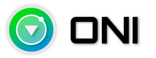

	
    <h3 align="center">Modern Modal Editing</h3>

	
	
	

	
	
	
	

<h2 align="center">Supporting Oni</h2>

Oni is an independent, MIT-licensed open source project. Please consider supporting Oni by:

*   [Become a backer or sponsor on Patreon](https://www.patreon.com/onivim)
*   [Become a backer or sponsor on Open Collective](https://opencollective.com/oni)
*   [Become a backer on BountySource](https://www.bountysource.com/teams/oni)

<h3 align="center">Sponsors via OpenCollective</h3>

<h4 align="center">Gold sponsors</h4>

<h4 align="center">Silver sponsors</h4>

## Introduction

Oni is a new kind of editor, focused on maximizing productivity - combining _modal editing_ with features you expect in modern editors. Oni is built with [neovim](https://github.com/neovim/neovim), and inspired by [VSCode](https://github.com/Microsoft/vscode), [Atom](https://atom.io/), [LightTable](http://lighttable.com/), and [Emacs](https://www.gnu.org/software/emacs/)

The vision of Oni is to build an editor that allows you to go from _thought to code_ as easily as possible - bringing together the raw editing power of Vim, the feature capabilities of Atom/VSCode, and a powerful and intuitive extensibility model - wrapped up in a beautiful package.

    

This repository is under **active development**, and until 1.0 please consider everything unstable.

Check out [Releases](https://github.com/onivim/oni/releases) for the latest binaries, or [Build Oni](https://github.com/onivim/oni/wiki/Development) from source. Consider making a donation via [OpenCollective](https://opencollective.com/oni) [BountySource](https://salt.bountysource.com/teams/oni) if you find this project useful!

## Features

Oni brings several IDE-like integrations to neovim:

*   [Embedded Browser](https://github.com/onivim/oni/wiki/Features#embedded-browser)
*   [Quick Info](https://github.com/onivim/oni/wiki/Features#quick-info)
*   [Code Completion](https://github.com/onivim/oni/wiki/Features#code-completion)
*   [Syntax / Compilation Errors](https://github.com/onivim/oni/wiki/Features#syntax--compilation-errors)
*   [Fuzzy Finding](https://github.com/onivim/oni/wiki/Features#fuzzy-finder)
*   [Status Bar](https://github.com/onivim/oni/wiki/Features#status-bar)
*   [Interactive Tutorial](https://github.com/onivim/oni/wiki/Features#interactive-tutorial)

And more coming - check out our [Roadmap](https://github.com/onivim/oni/wiki/Roadmap)

Oni is cross-platform and supports Windows, Mac, and Linux.

> If you're a Vim power user, and don't need all these features, check out our [minimal configuration](https://github.com/onivim/oni/wiki/How-To:-Minimal-Oni-Configuration).

## Installation

We have installation guides for each platform:

*   [Windows](https://github.com/onivim/oni/wiki/Installation-Guide#windows)
*   [Mac](https://github.com/onivim/oni/wiki/Installation-Guide#mac)
*   [Linux](https://github.com/onivim/oni/wiki/Installation-Guide#linux)

The latest binaries are available on our [Releases](https://github.com/onivim/oni/releases) page, and if you'd prefer to build from source, check out our [Development](https://github.com/onivim/oni/wiki/Development) guide.

## Goals

The goal of this project is to provide both the full-fledged Vim experience, with no compromises, while pushing forward to enable new productivity scenarios.

*   **Modern UX** - The Vim experience should not be compromised by terminal limitations.
*   **Rich plugin development** - using JavaScript, instead of VimL.
*   **Cross-platform support** - across Windows, OS X, and Linux.
*   **Batteries included** - rich features are available out of the box - minimal setup needed to be productive.
*   **Performance** - no compromises, Vim is fast, and Oni should be fast too.
*   **Ease Learning Curve** - without sacrificing the Vim experience.

Vim is an incredible tool for manipulating _text_ at the speed of thought. With a composable, modal command language, it is no wonder that Vim usage is still prevalent today.

However, going from thought to _code_ has some different challenges than going from thought to _text_. Code editors today provide several benefits that help to reduce **cognitive load** when writing code, and that benefit is tremendously important - not only in terms of pure coding efficiency and productivity, but also in making the process of writing code enjoyable and fun.

The goal of this project is to give an editor that gives the best of both worlds - the power, speed, and flexibility of using Vim for manipulating text, as well as the rich tooling that comes with an IDE. We want to make coding as efficient, fast, and fun as we can!

## Documentation

*   Check out the [Wiki](https://github.com/onivim/oni/wiki) for documentation on how to use and modify Oni.
*   [FAQ](https://github.com/onivim/oni/wiki/FAQ)
*   [Roadmap](https://github.com/onivim/oni/wiki/Roadmap)

## Available Plugins

Some available plugins created by Oni users are listed below (if you'd like to add your
plugin to this list please create a PR updating this **README** with the details).

*   [Oni Touchbar Plugin](https://github.com/jordan-arenstein/oni-plugin-touchbar) - by [jordan-arenstein](https://github.com/jordan-arenstein?tab=overview&from=2018-07-01&to=2018-07-31)
*   [quickFind](https://github.com/marene/quickFind) - by [marene](https://github.com/marene)
    *   Themes
        *   [Night Owl](https://github.com/Akin909/oni-theme-night-owl)

## Contributing

There many ways to get involved & contribute to Oni:

*   Support Oni financially by making a donation via:
    *   [Patreon](https://patreon.com/onivim)
    *   [OpenCollective](https://opencollective.com/oni)
    *   [Bountysource](https://salt.bountysource.com/teams/oni)
*   Thumbs up existing [issues](https://github.com/onivim/oni/issues) if they impact you.
*   [Create an issue](https://github.com/onivim/oni/issues) for bugs or new features.
*   Review and update our [documentation](https://github.com/onivim/oni/wiki).
*   Try out the latest [released build](https://github.com/onivim/oni/releases).
*   Help us [develop](https://github.com/onivim/oni/wiki/Development):
    *   Review [PRs](https://github.com/onivim/oni/pulls)
    *   Submit a bug fix or feature
    *   Add test cases
*   Create a blog post or YouTube video
*   Follow us on [Twitter](https://twitter.com/oni_vim)

## Acknowledgements

Oni is an independent project and is made possible by the support of some exceptional people. Big thanks to the following people for helping to realize this project:

*   the [neovim team](https://neovim.io/), especially [justinmk](https://github.com/justinmk) and [tarruda](https://github.com/tarruda) - Oni would not be possible without their vision
*   [jordwalke](https://github.com/jordwalke) for his generous support, inspiration, and ideas. And React ;)
*   [keforbes](https://github.com/keforbes) for helping to get this project off the ground
*   [Akin909](https://github.com/Akin909) for his extensive contributions
*   [CrossR](https://github.com/CrossR) for polishing features and configurations
*   [Cryza](https://github.com/Cryza) for the webgl renderer
*   [tillarnold](https://github.com/tillarnold) for giving us the `oni` npm package name
*   [mhartington](https://github.com/mhartington) for his generous support
*   [badosu](https://github.com/badosu) for his support, contributions, and managing the AUR releases
*   All our current monthly [sponsors](https://salt.bountysource.com/teams/oni/supporters) and [backers](BACKERS.md)
*   All of our [contributors](https://github.com/onivim/oni/graphs/contributors) - thanks for helping to improve this project!

Several other great neovim front-end UIs [here](https://github.com/neovim/neovim/wiki/Related-projects) served as a reference, especially [NyaoVim](https://github.com/rhysd/NyaoVim) and [VimR](https://github.com/qvacua/vimr). I encourage you to check those out!

Thank you!

## Contributors

This project exists thanks to all the people who have [contributed](CONTRIBUTING.md):

## License

MIT License. Copyright (c) Bryan Phelps

Windows and OSX have a bundled version of Neovim, which is covered under [Neovim's license](https://github.com/neovim/neovim/blob/master/LICENSE)

### Bundled Plugins

Bundled plugins have their own license terms. These include:

*   [typescript-vim](https://github.com/leafgarland/typescript-vim) (`oni/vim/core/typescript.vim`)
*   [targets.vim](https://github.com/wellle/targets.vim) (`oni/vim/default/bundle/targets.vim`)
*   [vim-commentary](https://github.com/tpope/vim-commentary) (`oni/vim/default/bundle/vim-commentary`)
*   [vim-unimpaired](https://github.com/tpope/vim-unimpaired) (`oni/vim/default/bundle/vim-unimpaired`)
*   [vim-surround](https://github.com/tpope/vim-surround) (`oni/vim/default/bundle/vim-surround`)
*   [vim-reasonml](https://github.com/reasonml-editor/vim-reason) (`.vim` files in `oni/vim/core/oni-plugin-reasonml`)
